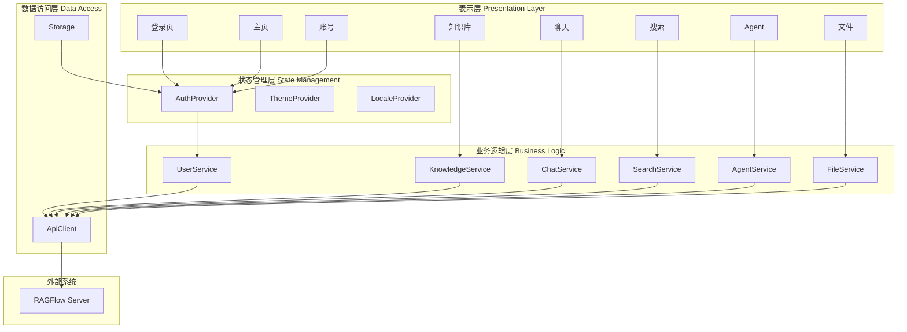
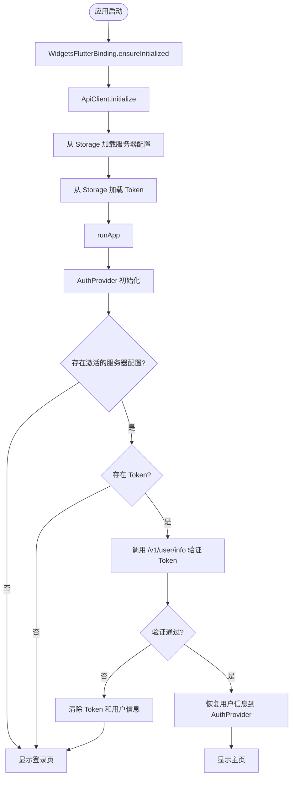
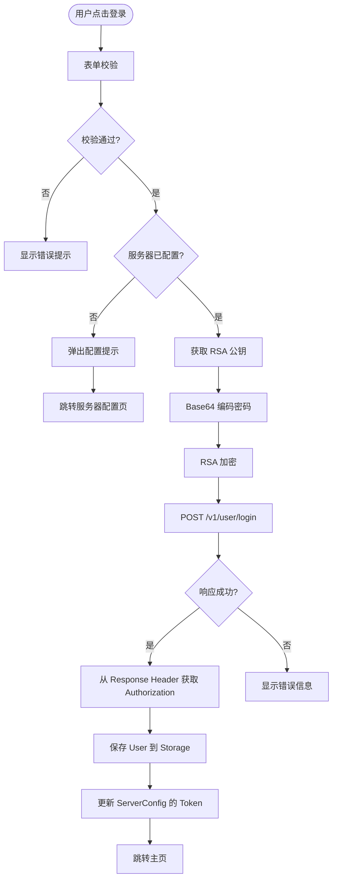
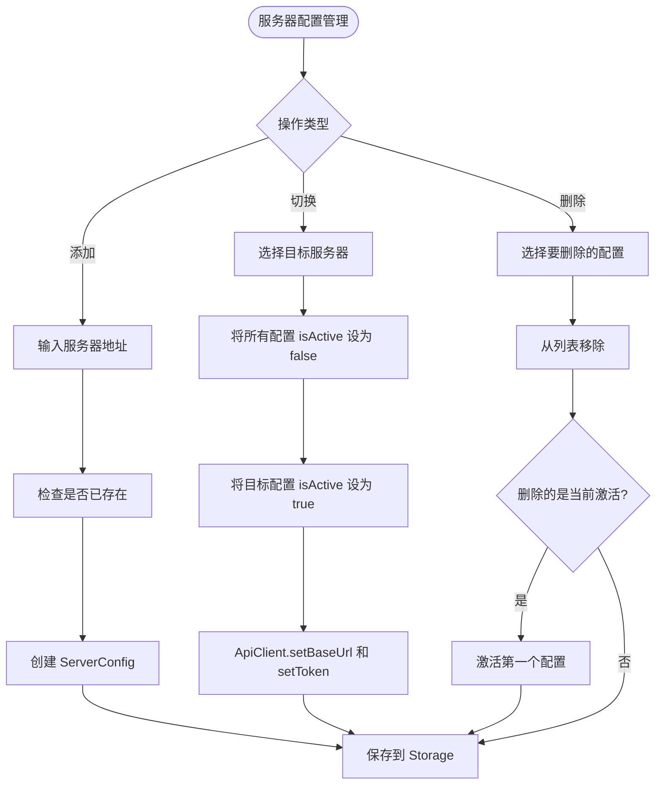
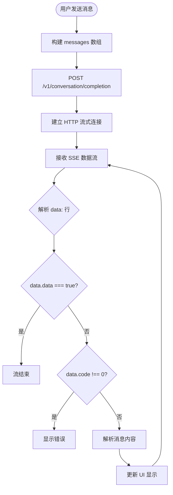
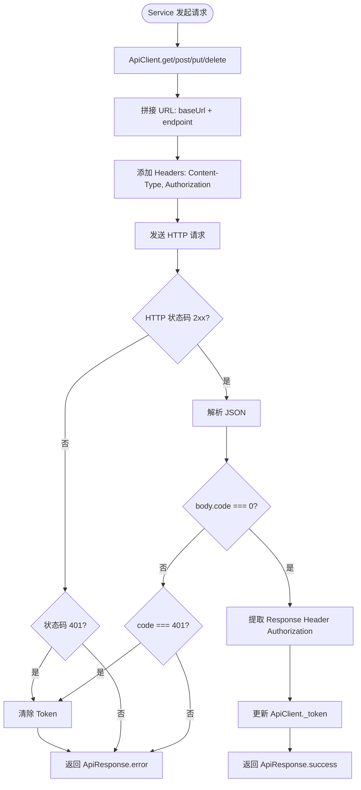
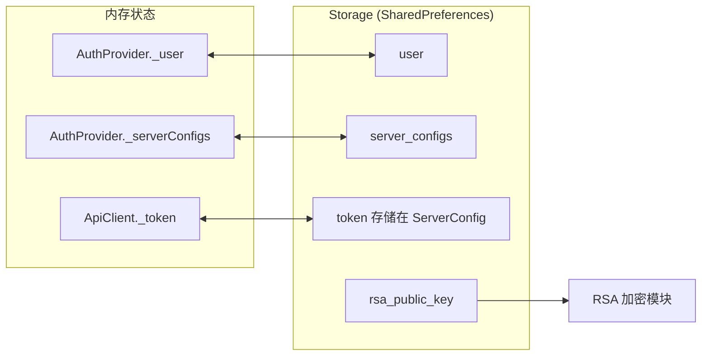
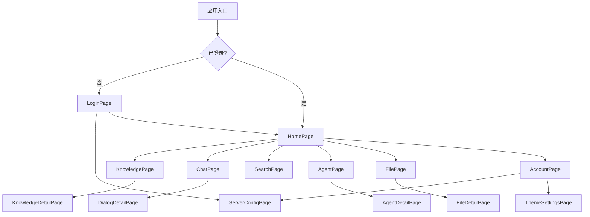

# RAGFlow 客户端 - 软件流程图

本文档包含软件著作权鉴别所需的程序设计流程图，使用 Mermaid 语法绘制，可在支持 Mermaid 的 Markdown 编辑器中查看。

---

## 1. 系统总体架构图

---

## 2. 应用启动流程图

---

## 3. 用户登录流程图

---

## 4. 多服务器配置与切换流程

---

## 5. 聊天消息发送与接收流程（SSE）

---

## 6. API 请求处理流程

---

## 7. 数据持久化流程

---

## 8. 页面导航结构图

---

**说明：** 以上流程图使用 Mermaid 语法编写，可使用支持 Mermaid 的工具（如 Typora、VS Code Mermaid 插件、GitHub、GitLab）渲染为图形。
